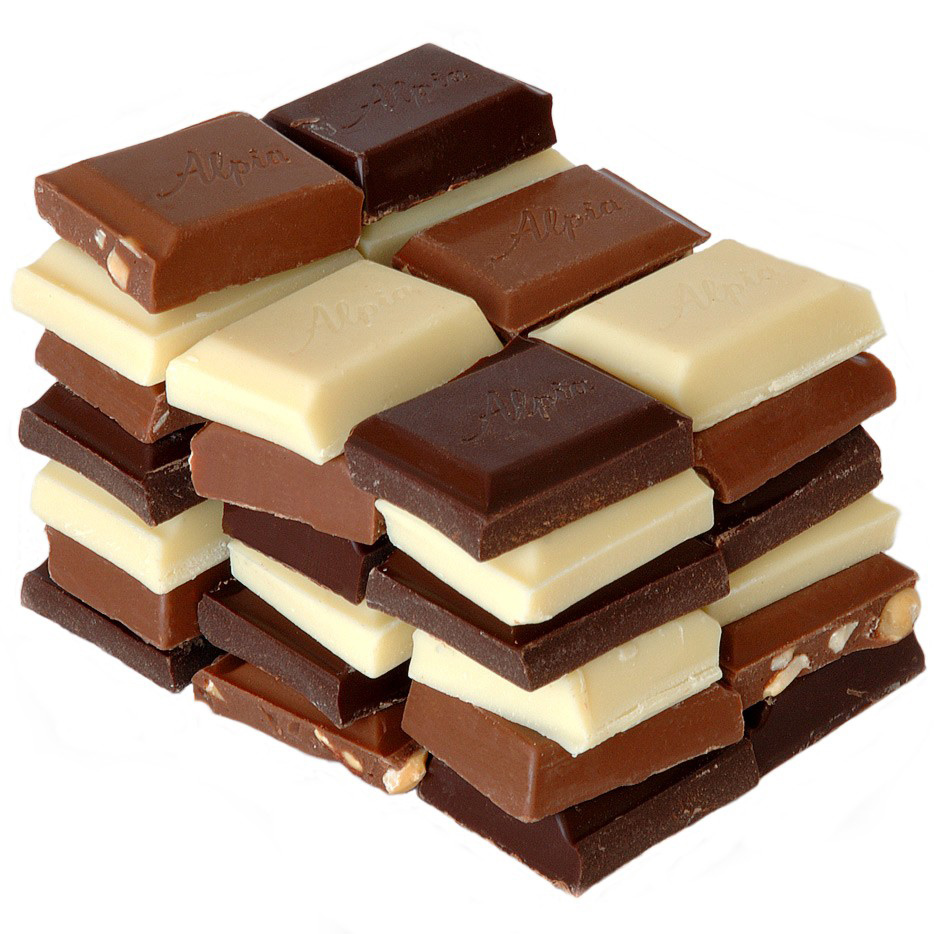

---
# Feel free to add content and custom Front Matter to this file.
# To modify the layout, see https://jekyllrb.com/docs/themes/#overriding-theme-defaults

layout: home
---
<h1 align="center">Chào mừng bạn đã đến với blog Chocolate CTDB</h1>

Cảm ơn bạn đã dành chút ít thời gian ghé thăm blog Chocolate CTDB. Nếu bạn là người mới, hãy xem qua phần LƯU Ý ở phía trên để có một trải nghiệm tốt nhất khi đọc blog. Nếu bạn muốn đọc những bài viết hãy xem qua phần BÀI VIẾT. Nếu bạn muốn biết thêm thông tin về blog cũng như người lập ra blog thì hãy xem qua phần THÔNG TIN. Cuối cùng, bạn có thể kéo xuống dưới page, nhập vào email và follow blog để có thể cập nhật được những bài viết mới vào mỗi tuần nhé.

